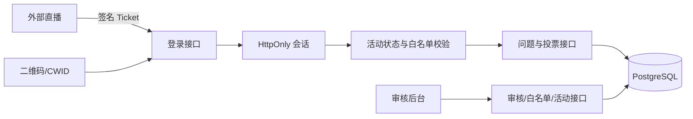
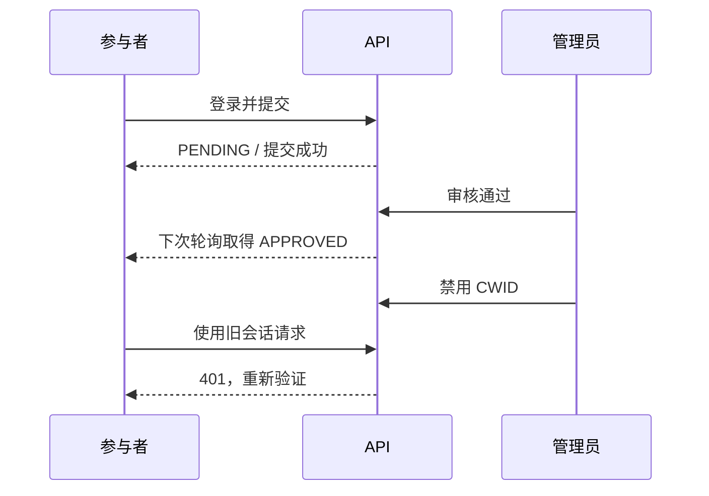

# 设计

沿用现有架构，无需引入其他开源项目。提问页面延续参考图的白底/蓝色、左侧输入与二维码、右侧双栏卡片；登录使用可配置品牌标志及活动主题区；后台拆为问题审核、白名单、活动设置三个导航页。

正确性：公开查询显式限定 APPROVED；身份字段仅在后台序列化；每次参与者请求校验当前准入；投票使用明确目标状态和唯一约束；后台刷新问题与活动表单解耦；分页排序追加 ID 作为稳定次序。

涉及：components 三个客户端及共享图标/品牌/分页；globals.css；lib 身份校验、审核转换；questions/vote/admin API；Prisma 初始迁移；集成验收、Docker 部署模板及文档。轮询沿用四秒，后台五秒，不引入 WebSocket。Ticket 仍是短期可重用凭证，不宣称一次性票据。

电脑参与页使用 100dvh 外壳、固定高度顶栏和填充剩余空间的左右布局。问题池外框与左侧二维码底边对齐；列表高度由剩余空间决定，ResizeObserver 按至少约 190px 行高确定每页 2/4/6/8 条，分页携带 pageSize。行数仅由窗口大小决定，不由当前问题数量决定。长问题在原生 dialog 中查看，支持关闭与 Escape，避免撑高页面。手机保持可读字号与单栏浏览。

当前入口改为公开匿名模式：链接和二维码直达 EventClient；旧 login 页面服务端 redirect。participantFor 仅判断活动开放状态，新记录统一匿名，不读取旧身份 Cookie。后台仍验证管理员会话。旧投票入口 410，所有问题列表固定创建时间倒序；历史身份与 Vote 表保留不迁移删除。
